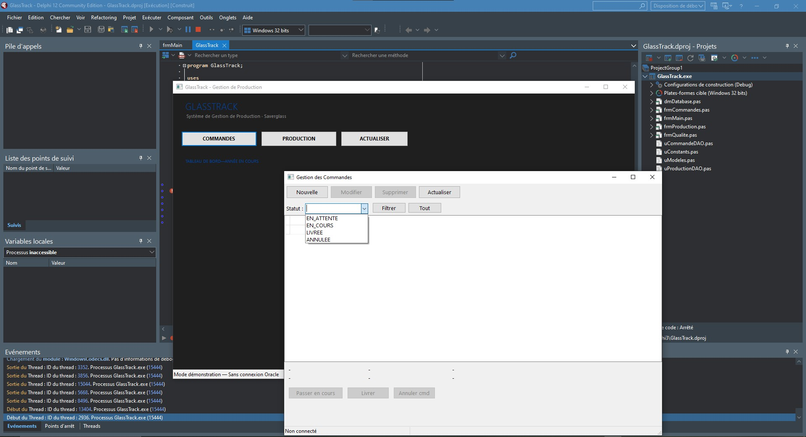

<div align="center">

# 🍾 Saverglass — Guide Delphi + Oracle

**Guide interactif de préparation à l'entretien développeur**
*Système de Gestion de Production · Architecture 3-tiers*

[](https://www.embarcadero.com/products/delphi)
[](https://www.oracle.com/database/)
[](https://docwiki.embarcadero.com/RADStudio/en/FireDAC)
[](https://www.oracle.com/database/technologies/appdev/plsql.html)
[](https://Spiritzen.github.io/saverglass-delphi-oracle)

[🚀 **Voir la démo**](https://Spiritzen.github.io/saverglass-delphi-oracle) · [📋 Cheat Sheet](#-cheat-sheet-rapide) · [🎯 Quiz](#-quiz-dentretien)

---

### 🖥️ Application GlassTrack en action



*Interface réelle — GlassTrack tournant sous Delphi 12, mode démonstration sans Oracle*

</div>

---

## 🏭 Contexte — Saverglass

**Saverglass** est le leader mondial du verre de luxe sur mesure — flacons de parfums, spiritueux et vins pour les plus grandes maisons (Chanel, Hennessy, Moët…). Leur SI de production repose sur **Delphi + Oracle**, une stack robuste et éprouvée dans les environnements industriels critiques.

Ce projet répond à une question concrète :
> *« Comment démontrer des compétences Delphi/Oracle solides sans expérience préalable dans ces technos ? »*

La réponse : construire un **mini-projet complet et documenté** — `GlassTrack` — qui simule exactement le type d'application développée chez Saverglass.

---

## ✨ Ce que contient ce repo

| Fichier / Dossier | Description |
|---|---|
| `index.html` | Guide interactif complet (6 onglets, quiz, cheat sheet) |
| `assets/css/style.css` | Design glassmorphism sombre, 100% custom |
| `assets/js/app.js` | Navigation, quiz interactif, copie de code |
| `assets/demo.jpg` | Screenshot de l'application GlassTrack en action |
| `src/GlassTrack.dpr` | Point d'entrée de l'application Delphi |
| `src/frmCommandes.pas` | Form UI — gestion des commandes clients |
| `src/frmProduction.pas` | Form UI — suivi des lots de fabrication |
| `src/uModeles.pas` | Couche métier — classes `TCommande`, `TLotProduction` |
| `src/dmDatabase.pas` | DataModule — connexion FireDAC + Oracle |
| `src/uCommandeDAO.pas` | Pattern DAO — CRUD commandes en base |
| `src/uProductionDAO.pas` | Pattern DAO — CRUD lots et qualité |
| `sql/schema.sql` | Création des tables, séquences, triggers |
| `sql/packages.sql` | Package PL/SQL `PKG_PRODUCTION` |

---

## 🏗️ Architecture 3-Tiers — GlassTrack

```
┌─────────────────────────────────────────────────────────────┐
│                    🖥️  COUCHE PRÉSENTATION                   │
│                                                             │
│   frmCommandes.pas          frmProduction.pas               │
│   ┌──────────────────┐      ┌──────────────────┐            │
│   │ TDBGrid          │      │ TDBLookupComboBox │            │
│   │ TComboBox        │      │ TMemo (stats)     │            │
│   │ TStatusBar       │      │ TStatusBar        │            │
│   └──────────────────┘      └──────────────────┘            │
└─────────────────────┬───────────────────────────────────────┘
                      │  Events / Handlers
┌─────────────────────▼───────────────────────────────────────┐
│                   ⚙️  COUCHE MÉTIER (BLL)                    │
│                                                             │
│   uModeles.pas                                              │
│   ┌──────────────────┐      ┌──────────────────┐            │
│   │ TCommande        │      │ TLotProduction    │            │
│   │ TFlacon          │      │ TStatsFour        │            │
│   │ EstModifiable()  │      │ EstEnAlerteCasse()│            │
│   └──────────────────┘      └──────────────────┘            │
└─────────────────────┬───────────────────────────────────────┘
                      │  DAO Calls
┌─────────────────────▼───────────────────────────────────────┐
│                   💾  COUCHE ACCÈS DONNÉES (DAL)             │
│                                                             │
│   dmDatabase.pas            uCommandeDAO.pas                │
│   ┌──────────────────┐      ┌──────────────────┐            │
│   │ TFDConnection    │      │ Inserer()         │            │
│   │ TFDTransaction   │      │ MAJStatut()       │            │
│   │ TFDQuery x6      │      │ Supprimer()       │            │
│   └──────────────────┘      └──────────────────┘            │
└─────────────────────┬───────────────────────────────────────┘
                      │  OCI / FireDAC Native Driver
┌─────────────────────▼───────────────────────────────────────┐
│                   🗄️  BASE DE DONNÉES ORACLE 19c             │
│                                                             │
│   Tables : COMMANDES · FLACONS · LOTS_PRODUCTION            │
│            CLIENTS · CONTROLE_QUALITE                       │
│   Objets  : Séquences · Triggers BEFORE INSERT              │
│             Package PKG_PRODUCTION · Vues                   │
└─────────────────────────────────────────────────────────────┘
```

---

## 📂 Les fichiers `.pas` expliqués

### 🖥️ Couche Présentation

#### `frmCommandes.pas`
Form principale de gestion des commandes clients.
```pascal
TfrmCommandes = class(TForm)
  DBGrid1      : TDBGrid;      // Grille liée aux données
  cboStatut    : TComboBox;    // Filtre par statut
  btnNouvel    : TButton;
  btnSupprimer : TButton;
  procedure FormCreate(Sender: TObject);
  procedure btnNouvelClick(Sender: TObject);
  procedure btnFiltrerClick(Sender: TObject);
end;
```

#### `frmProduction.pas`
Suivi des lots de fabrication : sélection commande, création lot, résultats, stats fours.

---

### ⚙️ Couche Métier

#### `uModeles.pas`
Classes métier avec héritage Object Pascal.
```pascal
TCommande = class
  function EstModifiable: Boolean;           // Règle métier
  function TransitionStatutAutorisee(...): Boolean;
end;

TLotProduction = class
  function EstEnAlerteCasse: Boolean;        // Seuil 5%
end;
```

---

### 💾 Couche Accès Données

#### `dmDatabase.pas` — Le DataModule central
> *Le DataModule est une Form invisible — c'est le pattern DAL standard de Delphi.*

```pascal
TDataModule1 = class(TDataModule)
  FDConnection1  : TFDConnection;
  FDTransaction1 : TFDTransaction;
  qryCommandes   : TFDQuery;
  qryLots        : TFDQuery;
  qryDashboard   : TFDQuery;
  procedure Connecter(const aMotDePasse: string);
  procedure DebuterTransaction;
  procedure Valider;
  procedure Annuler;
end;
```

#### `uCommandeDAO.pas` — Pattern DAO (Data Access Object)
```pascal
TCommandeDAO = class
  function  Inserer(aClientId, aFlaconId, aQuantite: Integer): Integer;
  procedure MAJStatut(aCmdId: Integer; const aStatut: string);
  procedure Supprimer(aCmdId: Integer);
  function  PeutEtreModifiee(aCmdId: Integer): Boolean;
end;
```

---

## 📚 Concepts couverts

### ⚡ Delphi 12 Athens

| Catégorie | Éléments |
|---|---|
| **Architecture** | Application 3-tiers, DataModule pattern, fichier `.dpr` |
| **Composants UI** | `TForm`, `TDBGrid`, `TDataSource`, `TDBLookupComboBox` |
| **FireDAC** | `TFDConnection`, `TFDQuery`, `TFDTransaction` |
| **Liaison données** | `TDataSource` comme médiateur Query ↔ composants visuels |
| **Object Pascal** | Classes, héritage, polymorphisme, `virtual`/`override` |
| **Gestion mémoire** | `Create(nil)` + `try/finally/Free` (pas de GC !) |
| **Exceptions** | `try/except on E: Exception do` |
| **CRUD** | `ExecSQL`, `RETURNING INTO`, `Open`, `Close` |
| **Cycle de vie** | `FormCreate`, `FormDestroy`, `DataModuleCreate` |

### 🗄️ Oracle 19c / PL/SQL

| Catégorie | Éléments |
|---|---|
| **DDL** | `CREATE TABLE`, contraintes `FK`, `CHECK`, `NOT NULL` |
| **Séquences** | `CREATE SEQUENCE` + trigger `BEFORE INSERT` pour auto-ID |
| **RETURNING INTO** | Récupération de l'ID généré sans `SELECT MAX()` dangereux |
| **Packages PL/SQL** | `PKG_PRODUCTION` — SPEC + BODY, procédures, fonctions, curseurs |
| **Requêtes avancées** | `WITH` (CTE), `RANK() OVER`, sous-requêtes corrélées |
| **Optimisation** | `EXPLAIN PLAN`, index composites, `ROWNUM` vs `FETCH FIRST` |
| **Transactions** | `COMMIT`, `ROLLBACK`, `SAVEPOINT`, isolation en Delphi |
| **Exceptions PL/SQL** | `WHEN NO_DATA_FOUND`, exceptions nommées custom |

---

## 🚀 Installation & Exécution

### Prérequis

| Outil | Version | Lien |
|---|---|---|
| RAD Studio / Delphi | 12 Athens (Community Edition OK) | [embarcadero.com](https://www.embarcadero.com/products/delphi/starter) |
| Oracle Database | 19c ou XE 21c (gratuit) | [oracle.com/xe](https://www.oracle.com/database/technologies/xe-downloads.html) |
| SQL Developer | 23.x | [oracle.com/sqldeveloper](https://www.oracle.com/tools/downloads/sqldev-downloads.html) |
| Navigateur | Chrome / Firefox / Edge | Pour le guide HTML |

### 1. Cloner le repo

```bash
git clone https://github.com/Spiritzen/saverglass-delphi-oracle.git
cd saverglass-delphi-oracle
```

### 2. Ajouter le screenshot de démo

```bash
# Copier votre screenshot dans assets/
cp votre_screenshot.jpg assets/demo.jpg

# Ou avec Claude CLI (automatisé) :
claude -p "Copie le fichier demo.jpg dans le dossier assets/ du repo"
```

### 3. Ouvrir le guide interactif

```bash
start index.html          # Windows
open index.html           # macOS
xdg-open index.html       # Linux
```

### 4. Initialiser la base Oracle (optionnel)

```sql
-- Dans SQL Developer, connecté en SYSDBA :
@sql/schema.sql        -- Crée les tables, séquences, triggers
@sql/packages.sql      -- Crée PKG_PRODUCTION
@sql/data_test.sql     -- Insère des données de démo
```

### 5. Ouvrir le projet Delphi

```
RAD Studio 12 → File → Open Project → src/GlassTrack.dpr
F9 → Run
```

---

## 🎯 Quiz d'entretien

Le guide inclut **6 questions typiques** d'un entretien Delphi/Oracle avec :
- Réponse immédiate + feedback visuel (✅ / ❌)
- Explication détaillée de chaque réponse
- Score en temps réel + barre de progression

**Extrait des questions :**
1. Qu'est-ce qu'un `TDataModule` en Delphi ?
2. Différence entre `.Post` et `.ApplyUpdates` en FireDAC ?
3. Comment récupérer l'ID généré après un `INSERT` Oracle ?
4. Rôle du `TDataSource` dans la liaison données ↔ UI ?
5. Quand utiliser `TFDQuery` vs `TFDTable` ?
6. Comment gérer une transaction multi-tables en Delphi ?

---

## 📋 Cheat Sheet rapide

### Delphi — Les essentiels

```pascal
// Connexion FireDAC
FDConn.Params.DriverID   := 'Ora';
FDConn.Params.Database   := '//localhost:1521/XEPDB1';
FDConn.Params.UserName   := 'glasstrk';
FDConn.Params.Password   := '****';
FDConn.Connected         := True;

// Requête paramétrée (anti SQL injection)
qry.SQL.Text := 'SELECT * FROM COMMANDES WHERE STATUT = :st';
qry.ParamByName('st').AsString := 'EN_COURS';
qry.Open;

// Transaction
FDConn.StartTransaction;
try
  qry.ExecSQL;
  FDConn.Commit;
except
  FDConn.Rollback;
  raise;
end;
```

### Oracle — Patterns courants

```sql
-- ID auto via séquence + RETURNING
INSERT INTO COMMANDES (CMD_ID, CLIENT_ID, STATUT)
VALUES (SEQ_COMMANDES.NEXTVAL, :cid, 'NOUVEAU')
RETURNING CMD_ID INTO :new_id;

-- CTE + fenêtrage
WITH RankedCmds AS (
  SELECT c.*, RANK() OVER (PARTITION BY CLIENT_ID ORDER BY DATE_CMD DESC) rk
  FROM COMMANDES c
)
SELECT * FROM RankedCmds WHERE rk = 1;

-- Appel package PL/SQL
CALL PKG_PRODUCTION.MAJ_STATUT_LOT(:lot_id, :new_statut);
```

---

## 📈 Ce que j'ai appris — Ma progression

> *Partir de zéro en Delphi/Oracle pour atteindre un niveau opérationnel en entretien.*

### 🔴 Avant — Les idées reçues
- *"Delphi c'est obsolète"* → Faux : Delphi 12 Athens (2023) est actif, cross-platform, utilisé dans des systèmes industriels critiques
- *"Object Pascal c'est du Pascal basique"* → Faux : generics, interfaces, RTTI, attributes, ARC sur mobile
- *"Oracle c'est juste du SQL"* → Faux : PL/SQL, packages, partitionnement, RAC, exécution parallèle

### 🟡 Pendant — Les vraies difficultés
- **Le `TDataModule`** : comprendre pourquoi il faut l'instancier *avant* toutes les forms dans le `.dpr`
- **`.Post` vs `.ApplyUpdates`** : deux niveaux de validation (mémoire vs base) — source de bugs insidieux
- **`RETURNING INTO`** : réflexe à acquérir pour éviter les race conditions sur les ID générés
- **La gestion mémoire** : en Delphi, pas de garbage collector. `Create` + `try/finally/Free` — toujours.
- **Les fichiers `.dfm`** : ne jamais mettre de commentaires `//` dans un `.dfm` — Delphi ne les supporte pas !

### 🟢 Après — Ce que je retiens
- L'architecture DataModule est **élégante** : séparation propre UI / données, partage global via variable `DataModule1`
- FireDAC est **puissant** : `CachedUpdates`, `TFDMemTable`, drivers natifs — bien au-dessus d'ADO
- Oracle PL/SQL permet de **pousser la logique métier côté base** quand c'est pertinent (performances massives)
- Delphi et Oracle forment une **stack très cohérente** pour les applications de gestion industrielle

---

## 🗂️ Structure du repo

```
saverglass-delphi-oracle/
│
├── index.html                  # Guide interactif (aucun serveur requis)
├── README.md                   # Ce fichier
│
├── assets/
│   ├── css/style.css           # Design glassmorphism custom
│   ├── js/app.js               # Tabs, quiz, copie de code
│   └── demo.jpg                # Screenshot de l'application GlassTrack
│
├── src/                        # Code Delphi compilable
│   ├── GlassTrack.dpr          # Point d'entrée application
│   ├── frmMain.pas / .dfm      # Dashboard principal + KPIs
│   ├── frmCommandes.pas / .dfm # UI — gestion commandes
│   ├── frmProduction.pas / .dfm# UI — suivi production
│   ├── frmQualite.pas / .dfm   # UI — contrôle qualité
│   ├── dmDatabase.pas / .dfm   # DAL — DataModule connexion
│   ├── uModeles.pas            # BLL — classes métier
│   ├── uCommandeDAO.pas        # DAL — pattern DAO commandes
│   ├── uProductionDAO.pas      # DAL — pattern DAO production
│   └── uConstants.pas          # Constantes globales
│
└── sql/
    ├── schema.sql              # DDL : tables, séquences, triggers
    ├── packages.sql            # PKG_PRODUCTION (PL/SQL)
    └── data_test.sql           # Données de démonstration
```

---

## 🤝 Contribuer

Ce projet est un support pédagogique. Si tu prépares toi aussi un entretien Delphi/Oracle :

1. **Fork** le repo
2. Ajoute tes propres questions de quiz ou blocs de code
3. Ouvre une **Pull Request** — les contributions sont bienvenues !

---

## 📄 Licence

MIT — libre d'utilisation, de modification et de partage.

---

<div align="center">

*Fait avec curiosité et détermination — parce que maîtriser une stack, ça se construit.*

**⭐ Star le repo si ce guide t'a aidé !**

</div>
